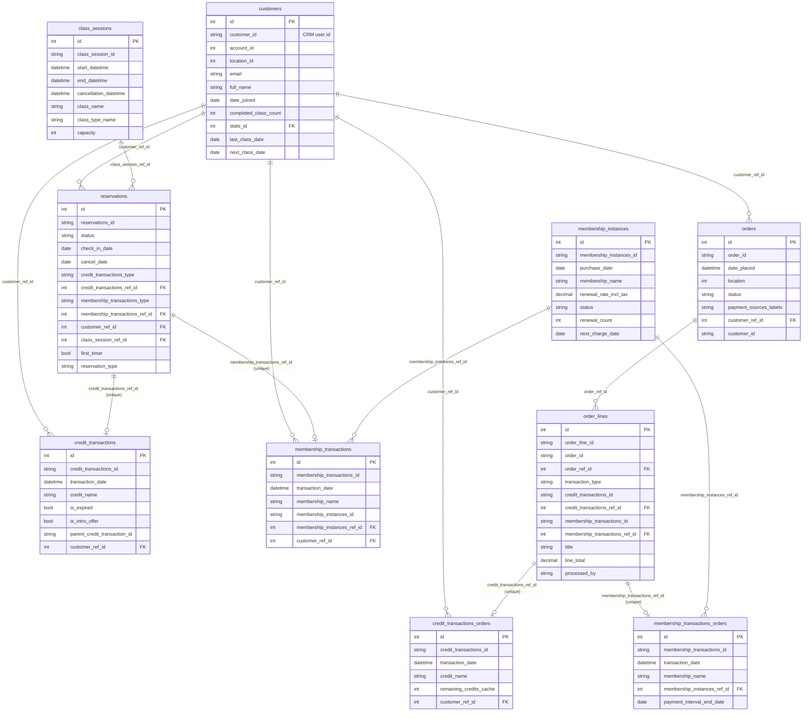
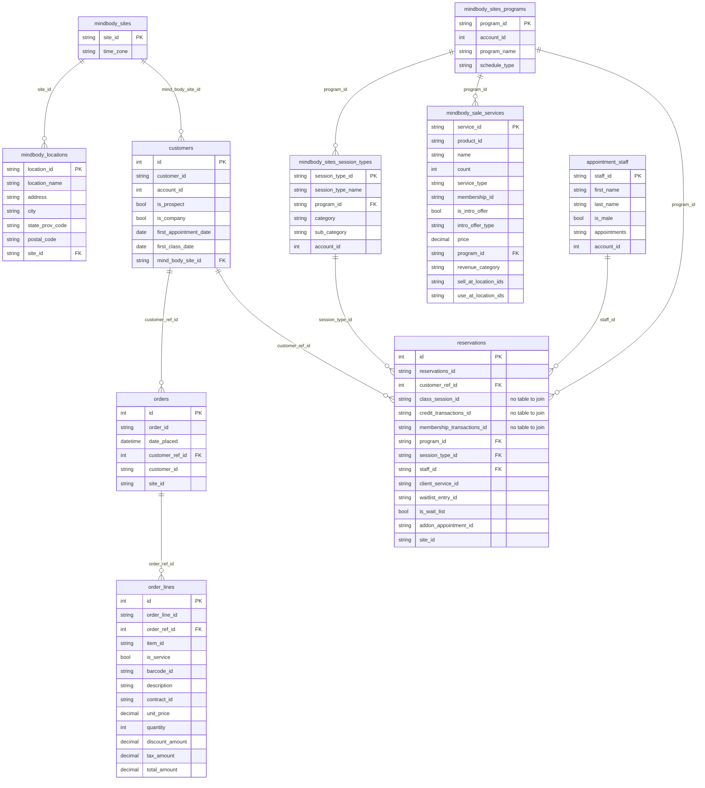

# CRM schemas: MarianaTek vs Mindbody

Comparison of the two CRM integrations' data models — what each stores, which tables
correspond, and what Mindbody is missing relative to the production MarianaTek model.

**Sources**

| what | where |
|---|---|
| MarianaTek model | `Revi-backend/src/packages/db/prisma/schema.prisma` (branch `dev`, 112 models) |
| Mindbody staging DDL | `revi-mindbody-crm-data-onboard/sql_cmds/create_staging_tables.sql` |
| Mindbody main writes | `revi-mindbody-crm-data-onboard/stg_to_main_services/*.py` |
| Integration registry | `crm_integrations` model; `IntegrationConstants.MINDBODY` in `src/constants/common.ts` |

MarianaTek is production. Mindbody has an onboarding pipeline of the same three-stage shape
(CRM → S3 → staging → main) but is not represented in the ORM.

---

## Headline findings

1. **Both sides land 10 main tables.** Four are shared (`customers`, `orders`,
   `order_lines`, `reservations`); each side has six of its own.
2. **Mindbody has no transaction ledger at all.** All six MarianaTek-only tables are the
   credit/membership transaction model plus `class_sessions`. Nothing on the Mindbody side
   corresponds.
3. **Mindbody's six tables are not in Prisma** — not on `dev`, not on `prod`. The backend
   cannot read them through the ORM.
4. **Mindbody also writes 22 columns into the shared tables that Prisma does not declare.**
   This is schema drift, not just missing models — see the last section, it is the most
   actionable item here.
5. **Mindbody carries transaction ids it cannot resolve.** `reservations` stores
   `credit_transactions_id` / `membership_transactions_id`, but with no transaction tables
   the corresponding `*_ref_id` foreign keys are never populated.

---

## MarianaTek — 10 tables

All ten are in Prisma with real foreign keys. `*_ref_id` columns are internal surrogate FKs
(pointing at `id`); the bare `*_id` columns are the CRM's own identifiers.

Note the **doubled transaction tables**. `credit_transactions` / `membership_transactions`
hang off `reservations`; `credit_transactions_orders` /
`membership_transactions_orders` hang off `order_lines`. Same CRM entity, split by which
side of the business it was reached from — a redemption versus a purchase.

---

## Mindbody — 10 tables

Ordered as `stg_to_main_orchestrator` runs them (dependency order, sequential, not parallel).

Only two Mindbody API endpoints appear in the code — `/client/clients` and
`/client/programs`. The other eight datasets are derived from those payloads or fetched
through paths built dynamically.

---

## Table equivalence

### Shared — same table, both integrations write it

| table | notes |
|---|---|
| `customers` | Same core identity columns. Mindbody adds 5 of its own; MarianaTek adds `isSubscribedToEmail`, `emailUnsubscribeHash`, `last_class_date`, `next_class_date`. Both key on `(account_id, customer_id)`. |
| `orders` | Mindbody's is thinner — no `status`, no `payment_sources_labels`. |
| `order_lines` | **Structurally different.** MarianaTek: `title` + `line_total` + links to transactions. Mindbody: a full commerce line — `item_id`, `unit_price`, `quantity`, `discount_*`, `tax1..tax5`, `total_amount`. |
| `reservations` | Both are the busiest table. MarianaTek resolves transaction FKs; Mindbody carries scheduling detail (program, session type, staff, waitlist, add-ons) instead. |

### MarianaTek-only — six tables, no Mindbody counterpart

| MarianaTek | nearest Mindbody concept | status |
|---|---|---|
| `class_sessions` | `mindbody_sites_session_types` is the *type*, not the scheduled instance | **partial** — a session type is a template; a class session is a dated occurrence with capacity. Mindbody `reservations.class_session_id` points at nothing. |
| `credit_transactions` | — | **missing** |
| `credit_transactions_orders` | — | **missing** |
| `membership_transactions` | — | **missing** |
| `membership_transactions_orders` | — | **missing** |
| `membership_instances` | `mindbody_sale_services.membership_id` is a catalogue reference only | **missing** — no per-customer membership record, so no `status`, `renewal_count`, `next_charge_date`, `renewal_rate_incl_tax`. |

### Mindbody-only — six tables, no MarianaTek counterpart

| Mindbody | nearest MarianaTek concept | notes |
|---|---|---|
| `mindbody_sites` | tenant subdomain (`extract_tenant_name`) | MarianaTek has no site table; tenancy is derived from the API base URL. |
| `mindbody_locations` | `location` int column on most rows | MarianaTek never stores location as an entity — no name, address or postcode anywhere. |
| `mindbody_sites_programs` | `class_sessions.class_type_name` (inline) | |
| `mindbody_sites_session_types` | `class_sessions.class_name` (inline) | |
| `mindbody_sale_services` | — | Product/service catalogue with pricing. MarianaTek has no catalogue table at all. |
| `appointment_staff` | — | MarianaTek only has `customer_notes.author_id`, an unresolved id. |

The shape of the difference: **MarianaTek models money and entitlement in depth**
(transactions, memberships, credits) while keeping the schedule flat. **Mindbody models the
schedule and catalogue in depth** (sites, locations, programs, session types, services,
staff) with no transaction ledger.

---

## What Mindbody is missing, ranked

1. **The entire transaction ledger** — six tables. Anything reading credits, memberships,
   renewals or intro-offer state works only for MarianaTek accounts.
2. **Dangling transaction ids.** `mb_reservations_stg` collects `credit_transactions_id`,
   `credit_transactions_type`, `membership_transactions_id`, `membership_transactions_type`
   and the main insert carries them through — but the insert writes no
   `credit_transactions_ref_id` / `membership_transactions_ref_id`. Those FK columns stay
   NULL on every Mindbody row, so joins that MarianaTek relies on return nothing rather than
   failing loudly.
3. **`class_sessions` never populated.** `reservations.class_session_id` and
   `class_session_ref_id` have no source. Scheduling data lives on the reservation row
   instead (`start_datetime`, `end_datetime`, `program_name`, `session_types_name`) — which
   works, but is a different query shape from MarianaTek's join.
4. **No `membership_instances`.** `mindbody_sale_services.membership_id` names a product,
   not a customer's live membership, so status and renewal state are unavailable.
5. **`orders.status` and `payment_sources_labels`** are not written for Mindbody.

---

## The Prisma gap — most actionable finding

Verified against `dev` at today's HEAD (`Merge pull request #2613`, 112 models) and against
`prod`. The two schemas are byte-identical for this purpose.

**All six Mindbody-only tables are absent from Prisma.** They exist only as `INSERT`
statements in the onboarding Lambda; the repo has no DDL for them either, so they are
created out of band.

**And 22 columns Mindbody writes into the shared tables are undeclared:**

| table | columns Mindbody writes that Prisma does not declare |
|---|---|
| `customers` | `is_prospect`, `is_company`, `first_appointment_date`, `first_class_date`, `mind_body_site_id` |
| `order_lines` | `item_id`, `is_service`, `barcode_id`, `description`, `contract_id`, `category_id`, `subcategory_id`, `unit_price`, `quantity`, `discount_percent`, `discount_amount`, `tax1`–`tax5`, `tax_amount`, `total_amount`, `notes`, `site_id` |
| `reservations` | `program_id`, `program_name`, `session_type_id`, `session_types_name`, `staff_id`, `staff_first_name`, `staff_last_name`, `client_service_id`, `waitlist_entry_id`, `is_wait_list`, `addon_appointment_id`, `addon_appointment_name`, `site_id` |
| `orders` | `site_id` |

(`category_id` does appear once in the schema, but on `notification_events` — unrelated.)

Two possibilities, and it is worth confirming which:

- **The columns exist in the database and Prisma is stale.** Then any `prisma migrate` or
  schema-diff would propose dropping them, and `prisma db pull` would reveal the drift.
- **The columns do not exist.** Then every Mindbody Stage 3 insert fails, and the pipeline
  has never successfully run against this database.

A single `prisma db pull` against the target database settles it. That is the first thing to
do before any of the modelling work above.

---

## Endpoints — the two APIs side by side

**MarianaTek** — `crm_sync/config.py::RESOURCE_CONFIG`. JSON:API: every record is
`{id, attributes:{}, relationships:{}}`, paginated by `page`/`page_size`, `meta.pagination`
carries the count.

**Mindbody** — `lambda_function.py::endpoint_mapping` (v6). Flat PascalCase JSON, one named
array per response (`Clients`, `Sales`, `Appointments`…), offset/limit paging.

| # | MarianaTek | Mindbody | one-to-one? |
|---|---|---|---|
| 1 | `/users` | `/client/clients` | yes |
| 2 | `/orders` | `/sale/sales` | **1 → 2**: one Mindbody call yields both orders and order_lines |
| 3 | `/order_lines` | `/sale/sales` → `PurchasedItems[]` | nested, not a separate call |
| 4 | `/reservations` | `/appointment/staffappointments` | yes |
| 5 | `/class_sessions` | — | **missing** (`/class/classes` not called) |
| 6 | `/credit_transactions` | — | **missing** |
| 7 | `/membership_transactions` | — | **missing** |
| 8 | `/membership_instances` | — | **missing** |
| 9 | `/user_notes` | — | **missing** |
| 10 | `/user_tags` | — | **missing** |
| — | — | `/site/sites` | Mindbody-only |
| — | — | `/site/locations` | Mindbody-only |
| — | — | `/site/programs` | Mindbody-only |
| — | — | `/site/sessiontypes` | Mindbody-only |
| — | — | `/sale/services` | Mindbody-only (catalogue) |
| — | — | `/staff/staff` | Mindbody-only |

MarianaTek calls 10 endpoints for 13 datasets; Mindbody calls 9 for 10 tables. Only
`appointments` takes a `locationIds` param — `sale_services` and `sales` 500 if given one
(noted in `lambda_function.py`), which is why the Mindbody pipeline is largely site-scoped
rather than location-scoped.

### Response fields actually read

| MarianaTek `/users` `attributes` | Mindbody `/client/clients` |
|---|---|
| `first_name`, `last_name`, `email`, `full_name` | `FirstName`, `LastName`, `Email` (no full name — composed) |
| `birth_date`, `phone_number`, `gender` | `BirthDate`, `Gender` |
| `city`, `country`, `state_province`, `postal_code` | `City`, `Country`, `State`, `PostalCode` |
| `date_joined` | `CreationDate` |
| `customer_state` | `Status` |
| `completed_class_count` | — |
| `is_opted_in_to_sms` | `SendPromotionalTexts`, `SendScheduleTexts` (**two flags, not one**) |
| — | `IsProspect`, `IsCompany`, `FirstAppointmentDate`, `FirstClassDate`, `HomeLocation`, `SiteID` |

| MarianaTek `/reservations` | Mindbody `/appointment/staffappointments` |
|---|---|
| `status`, `check_in_date`, `cancel_date`, `creation_date` | `Status` (no cancel/check-in/creation dates) |
| `user` (rel) | `ClientId` |
| `class_session` (rel) | `ProgramId` + `SessionTypeId` + `StartDateTime`/`EndDateTime` inline |
| `credit_transactions` (rel) | `ClientServiceId` — **see below** |
| `membership_transactions` (rel) | — |
| `first_timer` | `FirstAppointment` |
| `guest_email` | — |
| — | `Staff{}`, `IsWaitlist`, `WaitlistEntryId`, `AddOns[]` |

| MarianaTek `/orders` + `/order_lines` | Mindbody `/sale/sales` |
|---|---|
| `date_placed`, `location`, `status`, `payment_sources` | `SaleDate`, `SaleTime`, `SaleDateTime`, `OriginalSaleDateTime`, `LocationId`, `Payments[]` |
| `title`, `line_total` | `Description`, `UnitPrice`, `Quantity`, `TotalAmount` |
| `transaction_data` → credit/membership txn ids | `ContractId`, `PaymentRefId`, `BarcodeId` |
| `options`, `child_orders` | `CategoryId`, `SubCategoryId`, `IsService`, `Tax1`–`Tax5`, `TaxAmount`, `DiscountPercent`, `DiscountAmount`, `Returned`, `ExpDate`, `ActiveDate`, `GiftCardBarcodeId` |

Mindbody's line detail is far richer on the commerce side (tax breakdown, discounts,
returns, gift cards); MarianaTek's is richer on entitlement (`transaction_data` resolves to
a credit or membership transaction).

### The transaction gap — where Mindbody's equivalent actually lives

This is the important part. Mindbody **does** expose the entitlement model; we simply do not
call it. Three foreign keys already arrive in payloads we download and point at entities we
never fetch:

| id we already receive | where it comes from | what it points at | MarianaTek equivalent |
|---|---|---|---|
| `ClientServiceId` | `/appointment/staffappointments` | the pass/credit consumed by that appointment | `credit_transactions` (reservation side) |
| `ContractId` | `/sale/sales` → `PurchasedItems[]` | the membership contract bought | `membership_instances` |
| `MembershipId` | `/sale/services` | the membership product in the catalogue | (no MT equivalent — MT has no catalogue) |

So the three missing tables map to three uncalled endpoints. Candidate names from the
Mindbody Public API v6 — **these need verifying against the API before anyone builds on
them; I inferred the paths, the ids above are observed in code**:

| missing table | likely endpoint | resolves |
|---|---|---|
| `credit_transactions` | `/client/clientservices` | `ClientServiceId` from appointments |
| `membership_instances` | `/client/clientcontracts` | `ContractId` from purchased items |
| `membership_transactions` | contract autopay history, or `Payments[]` already inside `/sale/sales` | recurring charges |
| `class_sessions` | `/class/classes` | the scheduled occurrence behind an appointment |

Two of these may need no new endpoint at all:

- **`credit_transactions_orders`** — MarianaTek's order-side credit table. Mindbody's
  equivalent is already in hand: `PurchasedItems[]` where `IsService = true`. We download it
  and flatten it into `order_lines` instead of splitting it out.
- **`membership_transactions`** — `/sale/sales` returns a `Payments[]` array that the parser
  reads but does not persist beyond `PaymentRefId` on the line. Recurring membership charges
  plausibly surface there.

The practical consequence today: a Mindbody `reservation` records *that* an entitlement was
used (`client_service_id` is stored) but nothing about *what* it was — no credit name, no
expiry, no intro-offer flag, no remaining balance. Every MarianaTek feature reading
`credit_name`, `is_expired`, `is_intro_offer`, `remaining_credits_cache`, `renewal_count` or
`next_charge_date` has no Mindbody input.

### Notes and tags

`/user_notes` and `/user_tags` have no Mindbody counterpart in this pipeline at all, so
`customer_notes`, `customer_tags_default` and `customer_tag_assignments` are MarianaTek-only.
Mindbody does have client notes and client indexes in its API; neither is called.

---

## Open questions

- Is the Mindbody pipeline running against the same Aurora instance as MarianaTek, or a
  separate one? The shared table names imply the same, which is what makes the Prisma drift
  matter.
- Are the six Mindbody tables intended to be reachable from the backend, or is the pipeline
  purely a data-lake feed? If the former, they need Prisma models.
- Should Mindbody transaction ids be resolved at all, or is the intent to leave the ledger
  MarianaTek-only and gate features by `crm_integrations.name`?
